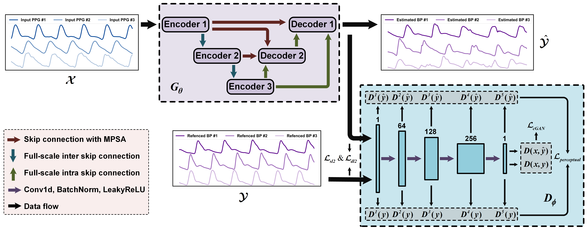
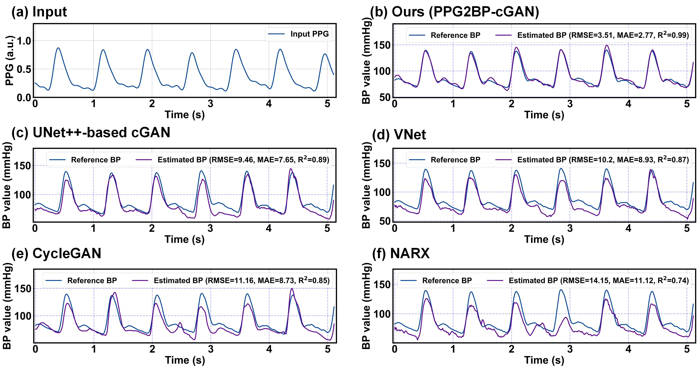
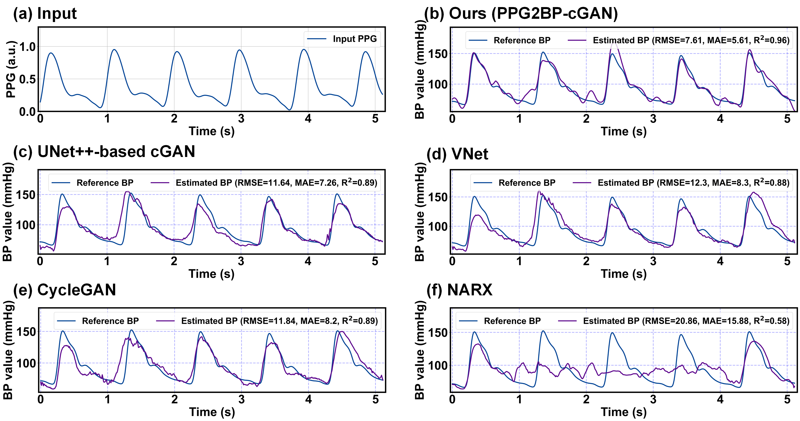

# SM4-PPG2BP-cGAN: Continuous Blood Pressure Waveform Estimation: Integrating Attention Mechanism and Conditional Adversarial Learning
#### *by: Chenbin Ma, Yangfan Xu, Peng Zhang, Fan Song, Yangyang Sun, Youdan Feng, Yufang He, Guanglei Zhang*


## Supplementary Materials for **PPG2BP-cGAN**

### Related Works for PPG-based BP Waveform Estimation
Please see `./.word` file.

<p align="center">

</p>

## Datasets
### Available Datasets
We used public MIMIC-III database and our collected Mindray database in this study.
- [MIMIC-III Waveform Database](https://physionet.org/content/mimic3wdb/1.0/)  
- [Mindray Database](https://ieeexplore.ieee.org/document/9795667/) 

## Implementation Code
### Requirmenets:
- Python3
- Pytorch==1.7
- Numpy==1.20.1
- scikit-learn==0.24.1
- Pandas==1.2.4
- skorch==0.10.0 (For DEV risk calculations)
- openpyxl==3.0.7 (for classification reports)
- Wandb=0.12.7 (for sweeps)

### Adding New Dataset
#### Structure of data
To add new dataset (*e.g.,* NewData), it should be placed in a folder named: NewData in the datasets directory.

Since "NewData" has several domains, each domain should be split into train/test splits with naming style as
"train_i_*x*.pt" and "test_i_*x*.pt" for each *i-th* fold.

The structure of data files should in dictionary form as follows:
`train.pt = {"samples": data, "labels: labels}`, and similarly for `test.pt`.

#### Configurations
Next, you have to add a class with the name NewData in the `configs/data_model_configs.py` file. 
You can find similar classes for existing datasets as guidelines. 
Also, you have to specify the cross-domain scenarios in `self.scenarios` variable.

Last, you have to add another class with the name NewData in the `configs/hparams.py` file to specify
the training parameters.

### PPG2BP-cGAN
### Existing Baseline Algorithms for BP Waveform Estimation
- [VNet](https://www.nature.com/articles/s41598-021-94913-y)
- [CycleGAN](https://ieeexplore.ieee.org/document/9871962)
- [NARX](https://ieeexplore.ieee.org/document/8963724)

### NOTE, The code will be made public after the paper is accepted.
### Adding New Algorithm
To add a new algorithm, place it in `algorithms/algorithms.py` file.

## Training procedure

The experiments are organised in a hierarchical way such that:
- Several experiments are collected under one directory assigned by `--experiment_description`.
- Each experiment could have different trials, each is specified by `--run_description`.
- For example, if we want to experiment different *Tremor Detection* methods with CNN backbone, we can assign
`--experiment_description UNet_backnones --run_description BPModel` and `--experiment_description UNet_backnones --run_description BPWave` and so on.

### Training a model

To train a model:

```
python main.py  --experiment_description exp1  \
                --run_description run_1 \
                --da_method PPG2BP-cGAN \
                --dataset Mindray \
                --backbone UNet \
                --num_runs 5 \
                --is_sweep False
```
### Launching a sweep
Sweeps here are deployed on [Wandb](https://wandb.ai/), which makes it easier for visualization, following the training progress, organizing sweeps, and collecting results.

```
python main.py  --experiment_description exp1_sweep  \
                --run_description sweep_over_lr \
                --da_method PPG2BP-cGAN \
                --dataset MIMIC \
                --backbone UNet \
                --num_runs 200 \
                --is_sweep True \
                --num_sweeps 50 \
                --sweep_project_wandb TEST
```
Upon the run, you will find the running progress in the specified project page in wandb.

`Note:` If you got cuda out of memory error during testing, this is probably due to DEV risk calculations.

### Upper and Lower bounds
To obtain the source-only or the target-only results, you can run `same_domain_trainer.py` file.

## Results
- Each run will have all the cross-domain scenarios results in the format `src_to_trg_run_x`, where `x`
is the run_id (you can have multiple runs by assigning `--num_runs` arg). 
- Under each directory, you will find the classification report, a log file, checkpoint, 
and the different risks scores.
- By the end of the all the runs, you will find the overall average and std results in the run directory.


## Visualizations
### Figures of the baseline model's comparison results with the proposed method's BP waveform estimation

For a fair comparison with other methods, a PPG signal was randomly selected from the original manuscript, 
and it was fed into the model to obtain the estimated BP waveform and calculate the corresponding evaluation metrics. 
Thus, Fig. 6 in the paper demonstrates a random sample. 
We selected one sample with median estimation performance and one sample with the worst performance, 
to be shown in Fig. S1 and Fig. S2, respectively. The visualization results from the supplementary experiments 
show that our proposed PPG2BP-cGAN method has better BP waveform estimation performance than the other methods.

<p align="center">

</p>

**Fig. S1.** Visualization and qualitative comparisons of different PPG-based BP waveform estimation results for the Mindray dataset with a paired PPG signal and the corresponding reference BP waveform. The sample pair is taken from the median performance of the estimated BP waveform from 10 randomly selected sample pairs. (a) Input normalized PPG signals and estimated BP waveforms by (b) our proposed PPG2BP-cGAN, (c) UNet++-based cGAN, (d) VNet, (e) classical CycleGAN, and (f) NARX. For accurate validation, we evaluated the root mean square error (RMSE), mean absolute error (MAE), and Pearson coefficients (R2) between the reference BP waveform and the estimated BP waveform.

<p align="center">

</p>

**Fig. S2.** Visualization and qualitative comparisons of different PPG-based BP waveform estimation results for the Mindray dataset with a paired PPG signal and the corresponding reference BP waveform. The sample pair is taken from the worst performance of the estimated BP waveform from 10 randomly selected sample pairs. (a) Input normalized PPG signals and estimated BP waveforms by (b) our proposed PPG2BP-cGAN, (c) UNet++-based cGAN, (d) VNet, (e) classical CycleGAN, and (f) NARX. For accurate validation, we evaluated the root mean square error (RMSE), mean absolute error (MAE), and Pearson coefficients (R2) between the reference BP waveform and the estimated BP waveform.

## Sensitivity Analysis

We supplement a sensitivity analysis of the proposed hyperparameters *δ* and *ξ* to provide the basis for selecting the optimal set of hyperparameters. 
Specifically, when *δ* is adjusted, it is fixed to 1 for *ξ* and vice versa. Fig. S3 illustrates how they affect the estimation of the proposed method for SBP and DBP. 
The experimental results found that hyperparameters *δ* and *ξ* have the same trend for the MAE of both SBP and DBP, i.e., the MAE decreases as the weights increase. 
When *δ* = *ξ* = 1, the MAE of SBP and DBP reached the minimum value of 3.15 and 2.21 mmHg, respectively. Therefore, we find that hyperparameters *δ* and *ξ* have the same effect on the joint optimization loss, 
and it is reasonable to perform the same value of regulation.

<p align="center">

</p>

**Fig. S3.** Sensitivity analysis for hyperparameters (a) *δ* and (b) *ξ* in the joint optimization objective function.

## Citation
If you found this work useful for you, please consider citing it.


## Contact
For any issues/questions regarding the paper or reproducing the results, please contact any of the following.   

Chenbin Ma:  *machenbin@buaa.edu.cn*

Guanglei Zhang:   *guangleizhang@buaa.edu.cn*   

 Beijing Advanced Innovation Center for Biomedical Engineering, 
 School of Biological Science and Medical Engineering, 
 Beihang University (BUAA), Beijing 100191, China