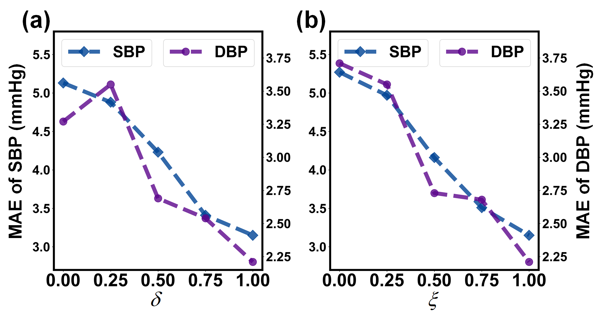

# SM4-PPG2BP-cGAN: Continuous Blood Pressure Waveform Estimation: Integrating Attention Mechanism and Conditional Adversarial Learning
#### *by: Chenbin Ma, Yangfan Xu, Peng Zhang, Fan Song, Yangyang Sun, Youdan Feng, Yufang He, Guanglei Zhang*

## Supplementary Material for **PPG2BP-cGAN**

## Datasets

### Available Datasets
We used public MIMIC-III database and our collected Mindray database in this study.
- [MIMIC-III Waveform Database](https://physionet.org/content/mimic3wdb/1.0/)  
- [MINDRAY Database](https://ieeexplore.ieee.org/document/9795667/) 

## Visualizations
### Figures of the baseline model's comparison results with the proposed method's BP waveform estimation

For a fair comparison with other methods, a PPG signal was randomly selected from the original manuscript, 
and it was fed into the model to obtain the estimated BP waveform and calculate the corresponding evaluation metrics. 
Thus, Fig. 6 in the paper demonstrates a random sample. 
We selected one sample with median estimation performance and one sample with the worst performance, 
to be shown in Fig. S1 and Fig. S2, respectively. The visualization results from the supplementary experiments 
show that our proposed PPG2BP-cGAN method has better BP waveform estimation performance than the other methods.

**Fig. S1.** Visualization and qualitative comparisons of different PPG-based BP waveform estimation results for the Mindray dataset with a paired PPG signal and the corresponding reference BP waveform. The sample pair is taken from the median performance of the estimated BP waveform from 10 randomly selected sample pairs. (a) Input normalized PPG signals and estimated BP waveforms by (b) our proposed PPG2BP-cGAN, (c) UNet++-based cGAN, (d) VNet, (e) classical CycleGAN, and (f) NARX. For accurate validation, we evaluated the root mean square error (RMSE), mean absolute error (MAE), and Pearson coefficients (R2) between the reference BP waveform and the estimated BP waveform.

**Fig. S2.** Visualization and qualitative comparisons of different PPG-based BP waveform estimation results for the Mindray dataset with a paired PPG signal and the corresponding reference BP waveform. The sample pair is taken from the worst performance of the estimated BP waveform from 10 randomly selected sample pairs. (a) Input normalized PPG signals and estimated BP waveforms by (b) our proposed PPG2BP-cGAN, (c) UNet++-based cGAN, (d) VNet, (e) classical CycleGAN, and (f) NARX. For accurate validation, we evaluated the root mean square error (RMSE), mean absolute error (MAE), and Pearson coefficients (R2) between the reference BP waveform and the estimated BP waveform.

## Sensitivity Analysis

We supplement a sensitivity analysis of the proposed hyperparameters *δ* and *ξ* to provide the basis for selecting the optimal set of hyperparameters. 
Specifically, when *δ* is adjusted, it is fixed to 1 for *ξ* and vice versa. Fig. S3 illustrates how they affect the estimation of the proposed method for SBP and DBP. 
The experimental results found that hyperparameters *δ* and *ξ* have the same trend for the MAE of both SBP and DBP, i.e., the MAE decreases as the weights increase. 
When *δ* = *ξ* = 1, the MAE of SBP and DBP reached the minimum value of 3.15 and 2.21 mmHg, respectively. Therefore, we find that hyperparameters *δ* and *ξ* have the same effect on the joint optimization loss, 
and it is reasonable to perform the same value of regulation.

**Fig. S3.** Sensitivity analysis for hyperparameters (a) *δ* and (b) *ξ* in the joint optimization objective function.

## Citation
If you found this work useful for you, please consider citing it.

## Contact
For any issues/questions regarding the paper or reproducing the results, please contact any of the following.   

Chenbin Ma:  *machenbin@buaa.edu.cn*

Guanglei Zhang:   *guangleizhang@buaa.edu.cn*   

 Beijing Advanced Innovation Center for Biomedical Engineering, 
 School of Biological Science and Medical Engineering, 
 Beihang University (BUAA), Beijing 100191, China